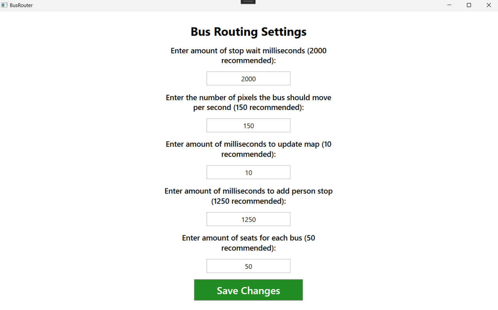
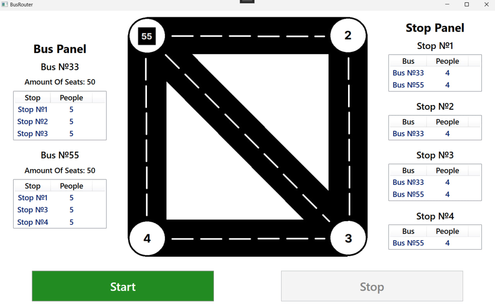
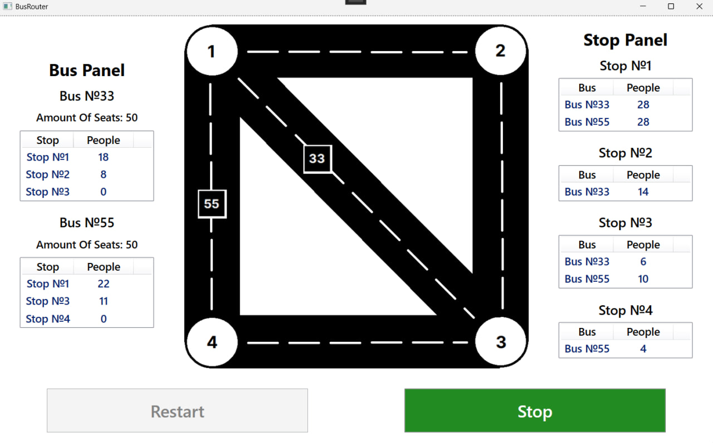

# BusRouter

A desktop simulation of urban transport logistics, built with **C#, .NET WPF, and MVVM architecture**. This project demonstrates **multithreading, thread synchronization, and real-time UI updates** in a concurrent environment.

---

# 📌 Project Overview

**BusRouter** models a city graph where buses navigate between stops, handling dynamic passenger flow. The simulation requires precise timing and thread safety to ensure that passenger boarding, movement, and UI rendering stay in sync.

### Key Functionalities:
1. **Autonomous Routing:** Two independent bus lines (No. 33 and No. 55) follow predefined routes across the network.
2. **Dynamic Passenger Flow:** A background generator creates passengers at configurable intervals, each with specific destination goals.
3. **Multithreaded Simulation:** Buses and passenger generators run on separate threads to simulate independent real-world entities.
4. **State Control:** Full support for Start, Stop (Pause), and Restart functionality without data corruption.
5. **Real-time Monitoring:** The UI displays live statistics for each bus and each stop queue.

---

# 🗂 Project Structure

```text
📦BusRouter
├── 📁 BusRouterUI/      # Presentation layer (WPF)
│   ├── Views
│   ├── ViewModels
│   ├── Commands
│   └── Stores
│
└── 📁 BLL/                # Business Logic Layer
    ├── Services
    └── Models
```

---

# 🛠 Technologies Used

| Category         | Technologies                                      |
| ---------------- | ------------------------------------------------- |
| **Language** | C#                                                |
| **Framework** | .NET WPF                                          |
| **Architecture** | MVVM (Model-View-ViewModel)                       |
| **Multithreading**| ThreadPool, Task, CancellationToken         |
| **Synchronization**| ManualResetEventSlim       |
| **Patterns** | Dependency Injection             |

---

# 📥 Getting Started

1. **Clone the repository:**
   ```bash
   git clone https://github.com/levtoshi/BusRouter.git
   ```
2. **Open the solution** in Visual Studio 2022 or later.
3. **Restore NuGet packages.**
4. **Run the application (F5).**

---

# ⚙️ Configuration & Settings

Before starting the simulation, users can fine-tune the environment:
* **Stop Wait Time:** Milliseconds a bus stays at a stop for boarding/unboarding.
* **Bus Speed:** Movement speed defined in pixels per second.
* **Map Update Interval:** Refresh rate for the UI map rendering.
* **Passenger Spawn Rate:** Frequency of new passengers appearing at stops.
* **Bus Capacity:** Maximum number of seats available in each bus.

---

# 🧠 Engineering Highlights

### Thread Synchronization
The most critical part of the project is managing shared resources. Since multiple buses can arrive at the same stop or interact with the passenger queue simultaneously, the project utilizes **thread synchronization primitives** to prevent race conditions and ensure data integrity.

### Responsive UI with MVVM
Heavy simulation logic is decoupled from the UI thread. Using `ObservableCollection` and `INotifyPropertyChanged`, the view updates automatically as the underlying data models change.

### Process Control (Pause/Resume)
Implemented using `ManualResetEventSlim`, allowing the entire simulation to "freeze" and "thaw" instantly without losing the current state of buses or passengers.

---


# 🖼️ Screenshots

### Program Settings



### Bus router before starting



### Bus router in process 



## 🎥 Simulation Demo
[<video src="Videos/bus-router.mp4" width="100%" controls autoplay loop muted></video>](https://github.com/levtoshi/BusRouter/blob/master/Videos/bus-router.mp4)
